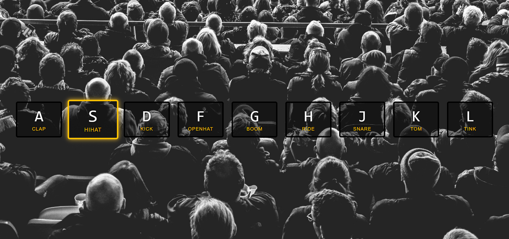

# 01---JavaScript-Drum-Kit

Created this awesome Drum Kit using HTML, CSS, and JS. 

### In this project learned about 
- data-* attribute
-  keyEvents
-  playing audio
-  listening for the transitionend event
